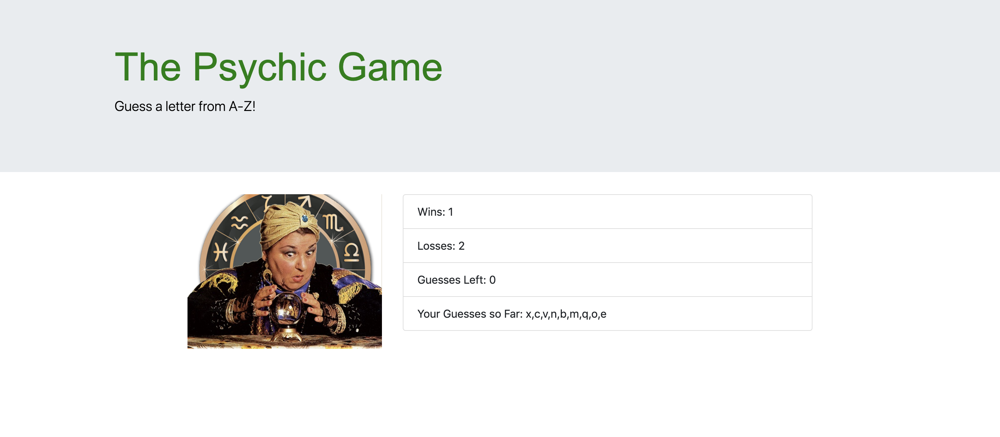

### I used HTML, CSS, Bootstrap, and JavaScript to build a letter guessing game.  You get 9 tries to guess a random letter and if you get it within those 9 tries, your win count will go up one, if you don't, your loss count will go up one.

## Tech I Used

1. [JavaScript](https://www.w3schools.com/js/js_intro.asp)
2. [BootStrap](https://getbootstrap.com/docs/4.3/getting-started/introduction/) 
3. [HTML](https://www.w3schools.com/html/html_intro.asp)
4. [CSS](https://www.w3schools.com/html/html_css.asp)

Author : [Matthew Kuh](https://github.com/matkuh)